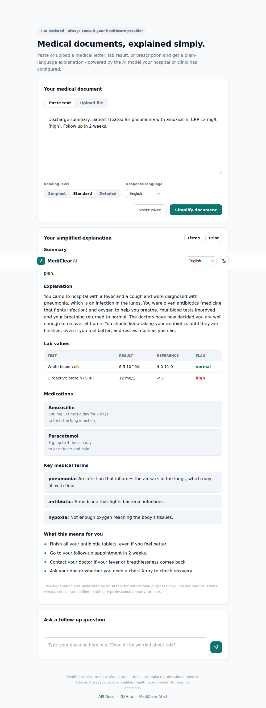
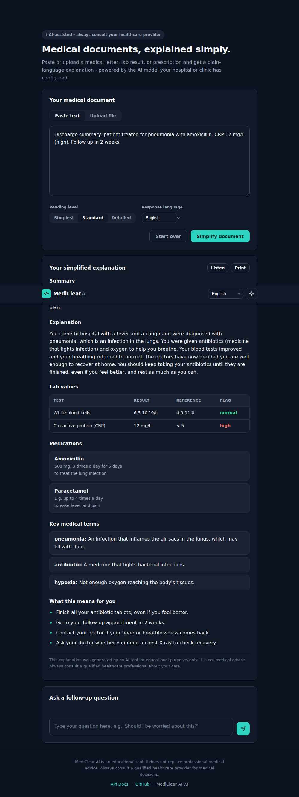

<div align="center">

# MediClear AI

**Turn dense medical documents into clear, patient-friendly explanations. Cloud or on-prem. API-first.**

A free, open-source FastAPI service that translates complex clinical language
into plain explanations at a configurable reading level (A2/B1/B2), in 17
languages, using the AI model of your choice. It returns structured JSON for
integrations and a clean web UI for people.

[](LICENSE)
[](https://www.python.org)
[](https://fastapi.tiangolo.com)
[](.github/workflows/ci.yml)

</div>

<p align="center">
  
  
</p>

---

## Contents

- [Highlights](#highlights)
- [Quick start](#quick-start)
- [Manuals](#manuals)
- [Deployment targets](#deployment-targets)
- [AI provider configuration](#ai-provider-configuration)
- [Using the API](#using-the-api)
- [Configuration](#configuration)
- [Development](#development)
- [Architecture](#architecture)
- [Contributing](#contributing)
- [License](#license)

---

## Highlights

- **Structured output.** Every analysis is a typed object: summary, explanation,
  key terms, action items, and (when present) lab values and medications, plus a
  rendered markdown view and a readability assessment. Built for EHR and mobile
  integration, not just display.
- **Faithful, grounded, measured.** Key terms are flagged if they are not in the
  source document, their definitions are backed by a bundled medical glossary
  (or an optional MedlinePlus lookup), and output readability is scored and can
  be re-simplified to hit a target reading level.
- **Provider-agnostic.** Google Gemini, OpenAI, Anthropic Claude, and any
  OpenAI-compatible server (Ollama, Azure, Groq, vLLM, LM Studio). Model names
  are free strings. Add a fallback chain for resilience, or use the built-in
  `demo` provider with no key at all.
- **API-first platform.** API-key auth, rate limiting, SSE streaming chat,
  session management, result caching, Prometheus metrics, unified errors.
- **Privacy-conscious.** Zero-retention mode, audit logging (metadata only), a
  fully offline / air-gapped path, and document content is never written to logs.
- **17 languages**, right-to-left aware output, optional text-to-speech (cloud
  or offline), and a clean light/dark web UI with no external dependencies.
- **Production-ready.** Docker, Helm chart, Nginx TLS config, Redis-pluggable
  state, health checks, structured JSON logging, and CI (ruff + mypy + pytest).

---

## Quick start

### Try it now (no API key)

```bash
git clone https://github.com/Thijsn04/MediClear-AI.git && cd MediClear-AI
pip install -e .
AI_PROVIDER=demo uvicorn app.main:app
# open http://localhost:8000
```

The `demo` provider returns a realistic canned analysis so you can explore the
full UI and API before wiring up a real model.

### With Docker

```bash
cp .env.example .env          # set AI_PROVIDER + key + model
docker compose up -d
open http://localhost:8000     # UI. API docs at /api/docs
```

### Without Docker

```bash
python -m venv .venv && source .venv/bin/activate
pip install '.[openai]'        # core + one provider (see extras below)
cp .env.example .env
uvicorn app.main:app --reload
```

**Install extras** (install only what you need):
`gemini` &middot; `openai` &middot; `anthropic` &middot; `redis` &middot; `ocr`
&middot; `tts-cloud` &middot; `tts-local` &middot; `metrics` &middot; `all`
&middot; `dev`. Example: `pip install '.[all,dev]'`.

---

## Manuals

| Guide | For |
|-------|-----|
| [Usage guide](docs/usage.md) | patients, integrators, and operators (with code samples) |
| [Configuration reference](docs/configuration.md) | every environment variable |
| [API reference](docs/api.md) | endpoints, schema, errors |
| [Architecture](docs/architecture.md) | how it fits together |
| [Deployment](deploy/README.md) | Docker, Compose, Helm, Nginx |

---

## Deployment targets

Both are reachable by configuration alone, from one codebase.

**Cloud, API-first**
```env
AI_PROVIDER=openai
OPENAI_API_KEY=sk-...
OPENAI_MODEL=gpt-4o
REQUIRE_API_KEY=true
API_KEYS=key-for-team-a,key-for-team-b
REDIS_URL=redis://redis:6379/0
ALLOWED_ORIGINS=["https://app.example.com"]
```

**On-prem / air-gapped (PHI never leaves your network)**
```env
AI_PROVIDER=openai
OPENAI_API_KEY=ollama
OPENAI_BASE_URL=http://localhost:11434/v1
OPENAI_MODEL=llama3.2
TTS_BACKEND=local
TERMINOLOGY_ONLINE=false
ZERO_RETENTION=true
```
The web UI ships with no CDN dependencies, so it works fully offline.

---

## AI provider configuration

Set `AI_PROVIDER` and the matching key/model. The model name is a free string.

```env
# Gemini
AI_PROVIDER=gemini
GOOGLE_API_KEY=...
GEMINI_MODEL=gemini-2.5-flash

# OpenAI (or Ollama / Azure / Groq / vLLM / LM Studio via OPENAI_BASE_URL)
AI_PROVIDER=openai
OPENAI_API_KEY=...
OPENAI_MODEL=gpt-4o

# Anthropic
AI_PROVIDER=anthropic
ANTHROPIC_API_KEY=...
ANTHROPIC_MODEL=claude-sonnet-4-5

# Optional: try these in order if the primary fails
AI_FALLBACK_PROVIDERS=anthropic,gemini
```

See [docs/configuration.md](docs/configuration.md) for OpenAI-compatible base URLs.

---

## Using the API

Base path `/api/v1`. Interactive docs at `/api/docs`. Full guide with Python and
JavaScript samples: [docs/usage.md](docs/usage.md).

```bash
# Analyse text into a structured result
curl -X POST http://localhost:8000/api/v1/analyze \
  -F "text=The patient presents with acute myocardial infarction." \
  -F "language=en" -F "reading_level=B1"

# Streamed follow-up (Server-Sent Events)
curl -N -X POST http://localhost:8000/api/v1/chat/$SESSION/stream \
  -H "Content-Type: application/json" \
  -d '{"message": "Should I be worried?", "language": "en"}'
```

| Method | Path | Description |
|--------|------|-------------|
| `GET`  | `/api/v1/health` | Provider and session-store status |
| `GET`  | `/api/v1/languages` | Supported languages |
| `POST` | `/api/v1/analyze` | Analyse text or file into a structured result |
| `POST` | `/api/v1/chat/{session_id}` | Follow-up question (grounded) |
| `POST` | `/api/v1/chat/{session_id}/stream` | Streaming follow-up (SSE) |
| `GET`/`DELETE` | `/api/v1/sessions/{session_id}` | Inspect / purge a session |
| `POST` | `/api/v1/audio` | Text-to-speech |
| `GET`  | `/metrics` | Prometheus metrics |

---

## Configuration

Every setting is an environment variable. Full table in
[docs/configuration.md](docs/configuration.md). Highlights: `AI_PROVIDER`,
`TARGET_READING_LEVEL`, `TERMINOLOGY_*`, `REQUIRE_API_KEY`/`API_KEYS`,
`RATE_LIMIT_*`, `REDIS_URL`, `ZERO_RETENTION`, `TTS_BACKEND`, `ENABLE_FRONTEND`,
`ALLOWED_ORIGINS`.

---

## Development

```bash
pip install '.[all,ocr,tts-local,dev]'

ruff check app/ tests/       # lint
ruff format --check app/ tests/
mypy app/                    # type check
pytest -q                    # tests (no API keys needed; uses a MockProvider)
```

CI runs the same gate on Python 3.11 and 3.12, plus a Docker build.

### Adding a provider

Providers are thin: implement one `_complete` (and optionally `_stream`)
primitive and the base class handles prompts, JSON parsing, and grounding. See
[CONTRIBUTING.md](CONTRIBUTING.md) and [docs/architecture.md](docs/architecture.md).

---

## Architecture

A layered FastAPI app. Providers are thin; the base class owns prompt building,
JSON parsing, and grounding. State (sessions, cache, rate limit) is pluggable
between in-memory and Redis. Full diagram and request lifecycle in
[docs/architecture.md](docs/architecture.md).

---

## Contributing

See [CONTRIBUTING.md](CONTRIBUTING.md) and [CODE_OF_CONDUCT.md](CODE_OF_CONDUCT.md).
Security reports: [SECURITY.md](SECURITY.md).

---

## License

MIT. See [LICENSE](LICENSE).

---

> **Medical disclaimer:** MediClear AI is an educational tool. It does not
> constitute medical advice and must not be used as a substitute for consultation
> with a qualified healthcare professional. Always refer medical decisions to a
> licensed clinician.

---

<div align="center">
<sub>Built by <a href="https://github.com/Thijsn04">Thijs Nannings</a> &middot; Medical Informatics @ UvA &middot; <a href="https://lythos.nl">Lythos</a></sub>
</div>
